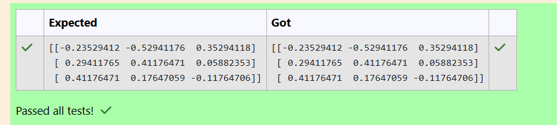

# INVERSE-OF-A-MATRIX
## Aim:
To write a python program to find the inverse of a matrix
## Equipment’s required:
1. 	Hardware – PCs
2. 	Anaconda – Python 3.7 Installation / Moodle-Code Runner
## Algorithm:

### Step 1:
Import NumPy for performing matrix operations.

### Step 2:
Create the matrix using numpy.array().

### Step 3:
Compute the inverse using numpy.linalg.inv().

### Step 4:
Print the resulting inverse matrix.


## Program:
#Program to find the inverse of a matrix.
#Developed by: Dashvin
#RegisterNumber:212224100008
```
import numpy as np
a=np.array([[1,0,3],[-1,2,-2],[2,3,-1]])
b=np.linalg.inv(a)
print(b)
```
## Output:

## Result:
Thus the inverse of given matrix is successfully solved using python program

